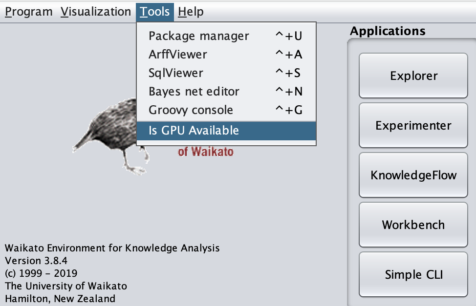

# Prerequisites
- Weka 3.8.4 or above ([here](https://sourceforge.net/projects/weka/files/latest/download))
- WekaDeeplearning4j package latest version ([here](https://github.com/Waikato/wekaDeeplearning4j/releases/latest))
- Java 8 or above

You need to unzip the Weka zip file to a directory of your choice.

#### CPU
For the package no further requisites are necessary.

#### GPU
The GPU additions needs the CUDA Toolkit 10.0, 10.1, or 10.2 backend with the appropriate cuDNN library to be installed on your system. Nvidia provides some good installation instructions for all platforms:

- CUDA Toolkit
    - [Linux](http://docs.nvidia.com/cuda/cuda-installation-guide-linux/index.html)
    - [Mac OS X](http://docs.nvidia.com/cuda/cuda-installation-guide-mac-os-x/index.html)
    - [Windows](http://docs.nvidia.com/cuda/cuda-installation-guide-microsoft-windows/index.html)

- CUDNN
    - [Linux](https://docs.nvidia.com/deeplearning/sdk/cudnn-install/index.html#install-linux)
    - [Windows](https://docs.nvidia.com/deeplearning/sdk/cudnn-install/index.html#install-windows)

# Installing the Weka Package
Weka packages can be easily installed either via the user interface as described [here](https://weka.wikispaces.com/How+do+I+use+the+package+manager%3F#toc2), or simply via the commandline:
```bash
$ java -cp <WEKA-JAR-PATH> weka.core.WekaPackageManager \
       -install-package <PACKAGE-ZIP>
```
where `<WEKA-JAR-PATH>` must be replaced by the path pointing to the Weka jar file, and `<PACKAGE-ZIP>` is the wekaDeeplearning4j package zip file.

You can check whether the installation was successful with
```bash
$ java -cp <WEKA-JAR-PATH> weka.core.WekaPackageManager \
       -list-packages installed
```
which results in
```
Installed	Repository	Loaded	Package
=========	==========	======	=======
1.5.6    	-----     	Yes	    <PACKAGE>: Weka wrappers for Deeplearning4j
```

## Add GPU Support

To add GPU support, [download](https://github.com/Waikato/wekaDeeplearning4j/releases/latest) and run the latest `install-cuda-libs.sh` for Linux/Macosx or `install-cuda-libs.ps1` for Windows. Make sure CUDA is installed on your system as explained [here](#gpu).

The install script automatically downloads the libraries and copies them into your wekaDeeplearning4j package installation. If you want to download the library zip yourself, choose the appropriate combination of your platform and CUDA version from the [latest release](https://github.com/Waikato/wekaDeeplearning4j/releases/latest) and point the installation script to the file, e.g.:
```bash
./install-cuda-libs.sh ~/Downloads/wekaDeeplearning4j-cuda-10.2-1.6.0-linux-x86_64.zip
```

### Check your GPU is Available

Ensuring your GPU is setup correctly may be difficult so to help out we've provided `IsGPUAvailable`, a simple diagnostic tool to test whether your
GPU is identified and available to WekaDeeplearning4j.

If the tool returns `true`, your GPU is setup correctly and ready to use!

If the tool returns `false`, your GPU is not available to WekaDeeplearning4j (e.g., caused by incorrect drivers) and will
not be used.

#### GUI

Once WekaDeeplearning4j is installed, you can find `IsGPUAvailable` in the `Tools` menu in the `GUIChooser`:



Simply click `Check...` and WekaDeeplearning4j will check your GPU's availability.

#### Commandline

Simply invoke the tool from the commandline: 
```bash
$ java -cp <WEKA-JAR-PATH> weka.Run .IsGPUAvailable
```

The output for an incorrectly setup GPU will look like:
```bash
...
...
false
```
And for a correctly setup GPU:
```bash
...
...
true
```

# Using WekaDeeplearning4j via Reflection
One way to use this package through the Java API is to use reflection. In this case, the WekaPackageManager
loads this library at runtime. This has the benefit of not needing to include the WekaDeeplearning4j `.jar` file
in your CLASSPATH, however, means that the IDE cannot type-check the arguments. 

##### Java examples with reflection
* [Classifying a Custom Dataset](examples/classifying-your-own.md)
* [Image Feature Extraction](examples/featurize-mnist.md)


# Using WekaDeeplearning4j in a Maven Project
It is also possible to include this package as maven project. As of now it is not provided in any maven repository, therefore you need to install this package to your local `.m2` repository:

```bash
$ git clone https://github.com/Waikato/wekaDeeplearning4j.git
$ cd wekaDeeplearning4j
$ ./gradlew build -x test publishToMavenLocal

```

or, if you want the cuda version:

```bash
$ ./gradlew build -x test publishToMavenLocal -Dcuda=<CUDA-VERSION> # Replace <CUDA-VERSION> with either "10.0", "10.1", or "10.2"
```

Now you can add the maven dependency in your `pom.xml` file 
```xml
<dependency>
    <groupId>nz.ac.waikato.cms.weka</groupId>
    <artifactId>wekaDeeplearning4j</artifactId>
    <version>${wekaDeeplearning4j.version}</version>
</dependency>
```

Note that building WekaDeeplearning4J from source is only supported on Ubuntu. 
If you wish to include this package in a maven project on Windows then download the latest `.zip`
file (e.g. `wekaDeeplearning4j-1.15.14.zip`) from the [releases page](https://github.com/Waikato/wekaDeeplearning4j/releases), extract to get the 
`wekaDeeplearning4j-x.x.x.jar` file, and install this `.jar` file in your local maven repository via [these instructions](https://maven.apache.org/guides/mini/guide-3rd-party-jars-local.html).
